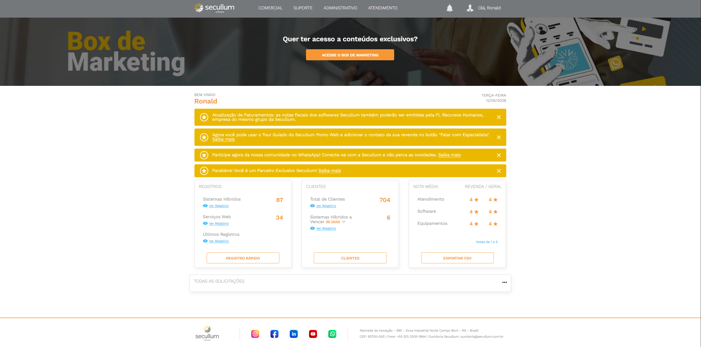
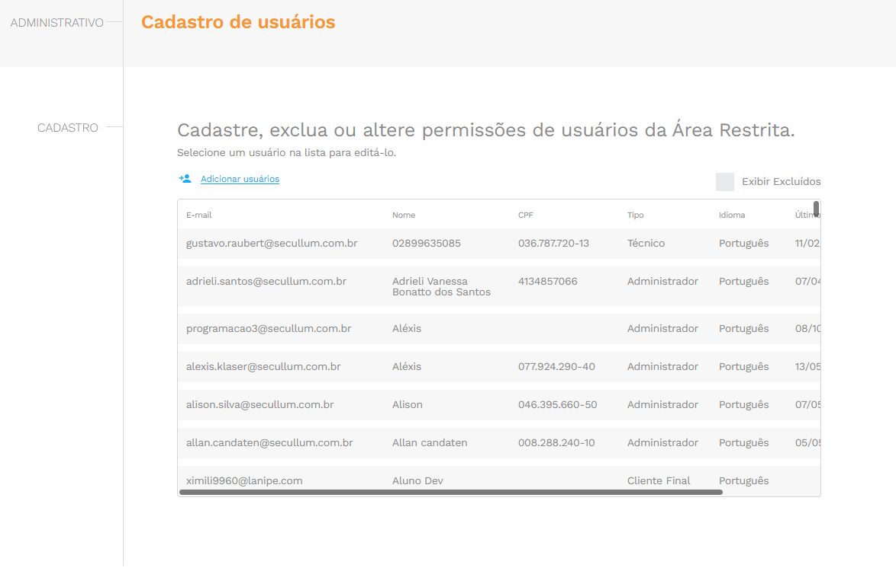
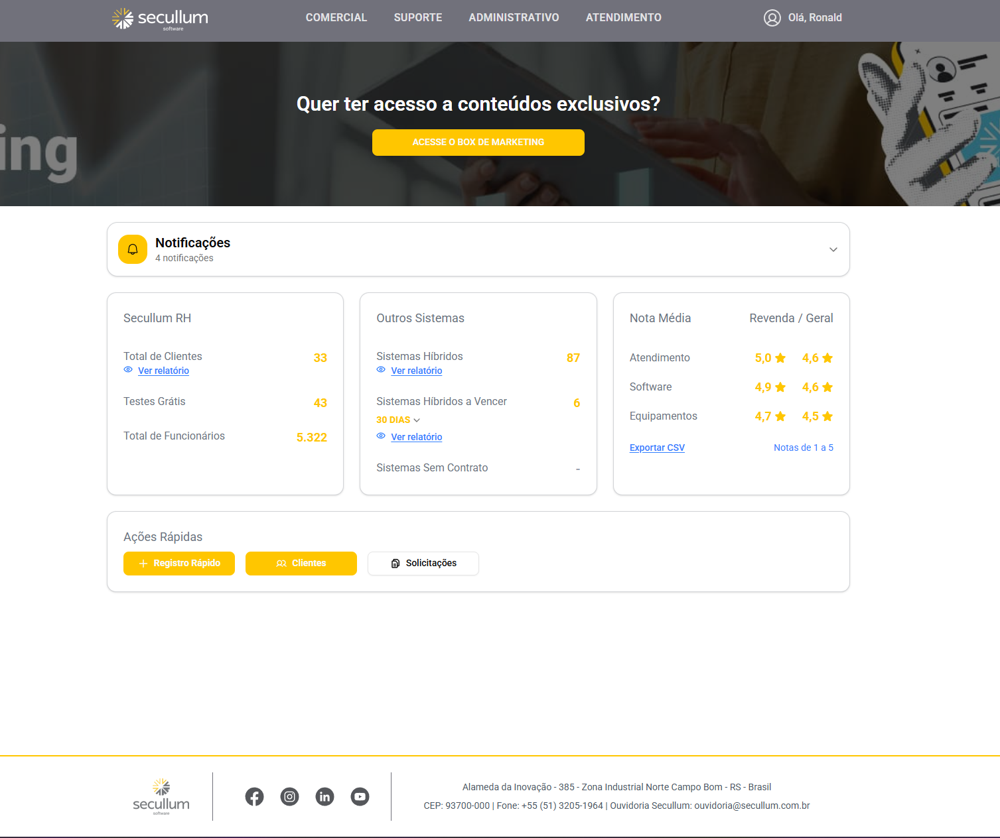

## Área da revenda

---

## Introdução

- A equipe F vem trabalhando na área da revenda desde o final de 2025
- O lançamento da primeira versão será em breve
- O projeto usa alguns padrões diferentes do pontoweb
- Em algum momento vocês vão precisar mexer no projeto

---

## Área restrita (projeto antigo) 🚮

É um portal "back office" aos nossos revendedores, com acesso a registro de clientes, relatórios, dados financeiros, entre outros.

É um projeto em PHP desenvolvido por uma empresa terceirizada.



---
clickAnimation: left
---

## Problemas do projeto antigo

<div class="relative">

<div v-click.hide class="absolute top-0">

### Design datado

<div class="flex gap-4 w-full">

  

  
</div>

</div>

<div v-click="[1,2]" class="absolute top-0">

### Falhas de segurança

- Versão do PHP é 5.6, lançada em 2014
- Segurança nunca foi uma prioridade
- Por meio desse projeto é possível acessar dados de TODOS os nossos revendedores e clientes

- Exemplos:
  - [Área restrita - Adicionar flags de segurança no cookie de sessão](https://gitlab.com/secullum/sec-issues/-/work_items/13346)
  - [Area Restrita - Falha de segurança (upload/editor)](https://gitlab.com/secullum/sec-issues/-/work_items/12058)
  - [Área restrita - Evitar Cross-site scripting (XSS)](https://gitlab.com/secullum/sec-issues/-/work_items/13353)

</div>

<div v-click="[2,3]" class="absolute top-0">

### Arquitetura insustentável

- Comportamentos estranhos e falta de documentação
- Não segue nenhum padrão de projeto conhecido no planeta Terra
- Muito complexo sem motivo aparente
- Muito acoplamento
- Muitas gambiarras
- PHP.

</div>

<div v-click="3" class="duration-2000! absolute top-0">

```php
// GAMBIARRA!
/**
* Como a API retorna uma página inteira HTML, devemos procurar pela string quando não acha o email!
* Uma alternativa seria chamar o método de buscar conta dessa classe aqui e se encontrar, efeessa requisição  aqui,
* porém eles já tem essa lógica dentro do esqueci minha senha da API, enfim, é uma alternativa.
*/
if (strpos($wsReturn, 'Email n&#xE3;o cadastrado')) {
  return Language::getTranslation('tela-login-erro-esqueci-senha-email-nao-encontrado');
}
```

</div>

</div>

---
layout: image-right
image: /images/tobbers.png
---

## Solução?

<ph-sparkle-fill class="text-yellow"/> Um novo projeto

---

## O que é a área da revenda?

- Migração do projeto antigo para tecnologias mais modernas
- Arquitetura que permite melhorias e manutenção
- Confiança no código via testes unitários
- Segurança pensada desde o princípio
- Documentação atualizada
- (Quase) Redesign



---

## Migração

ℹ️ Vamos lançar somente com as páginas de:

- Login
- Recuperar senha
- Dashboard

ℹ️ **Quanto às outras páginas:**

- Serão lançadas gradualmente conforme desenvolvemos
- Novo vai redirecionar as páginas não lançadas para o site antigo
- Antigo redirecionará para o novo quando as páginas forem lançadas no novo
- Antigo será desativado após todas as páginas migradas

---

## Autenticação durante a migração

### Premissas

- Experiência do usuário precisa ser fluida
- Usuário não deve precisar logar em cada site
- Deve compartilhar permissões

<div class="h-1 my-2"> </div>

### Solução

- Novo site se tornará a autoridade de autenticação
  - Login será feito exclusivamente nele (página login do antigo redireciona para o novo)
- Sites vivem no mesmo domínio e compartilham cookie de autenticação
- Site antigo usa sessions do php, não JWT
  - A cada requisição vai validar JWT e setar a session 

---

## Fluxo de autenticação

<div
  v-click.hide
>

</div>

<div
  v-motion
  v-click="[1,5]"
  :initial="{ y: -742 }"
  :click-1="{ y: -842 }"
  :click-2="{ y: -950 }"
  :click-3="{ y: -1050 }"
  :click-4="{ y: -1150 }"
  :click-5="{ y: -1250 }"
>

</div>

<div
  v-click="5"
>

</div>

---

## Urls

|                    | Antigo                      | Novo                             |
| ------------------ | --------------------------- | -------------------------------- |
| Durante a migração | **revenda.secullum.com.br** | **nova-revenda.secullum.com.br** |
| Após a migração    | N/A                         | **revenda.secullum.com.br**      |

📈 As vantagens de manter a url durante a migração são:

- Se algo quebrar no novo, podemos simplesmente desabilitar a migração
- O antigo continuará funcionando normalmente, sem necessidade de redirecionamento

---
class: text-sm
---

## Configuração de redirecionamento no site antigo

| Nome                | Tipo          | Descrição                                             |
| ------------------- | ------------- | ----------------------------------------------------- |
| `NOVO_SITE_URL`     | string        | Url do front do novo site                             |
| `NOVO_SITE_API_URL` | string        | Url da api do novo site                               |
| `NOVO_SITE_ATIVO`   | boolean       | Ativa ou desativa os redirects de forma global        |
| `NOVO_SITE_PAGINAS` | string (json) | Define as páginas com redirect ativo e o caminho novo |

Exemplo de configuração em um ambiente local:

```dotenv
NOVO_SITE_URL=http://localhost:5173/
NOVO_SITE_API_URL=http://host.docker.internal:8081/
NOVO_SITE_ATIVO=true
NOVO_SITE_PAGINAS={ "login": { "ativo": true, "caminho": "login"  }, "novo_cliente": { "ativo": true, "caminho": "trial" } }
```

---

## Segurança

- Estamos usando tecnologias modernas e atualizadas
- Já nascemos usando cookies com flags de segurança (Secure, HttpOnly e SameSite)
- Seguimos boas práticas de segurança. Exemplos:
  - Evitamos enumeration attacks no login e esqueci minha senha
  - Cors configurado corretamente

---

## Arquitetura

- UI -> React 19, Vite, Tailwind, Shadcn/ui, Vitest browser mode, Tanstack Query e Router
- Backend -> .Net 10
  - API -> Asp.Net
  - Core -> Entity Framework, arquitetura em camadas, testes unitários, etc
  - Data -> Entidades e contextos dos bancos de dados
  - Orfi -> Entidades, contexto e services específicas do banco Orfi
  - Infra -> Utilitários de infra usados entre os outros projetos

---
layout: image-right
image: /images/tobbers-natal.png
---

## Algumas coisas que estamos fazendo diferente do pontoweb

---

## Conexão com 3 bancos de dados

- ContaSecullum -> banco de dados do Autenticador
- SiteSecullum -> banco de dados da área restrita mas misturado com o SA
- Orfi -> banco de dados do SA

ℹ️ Criamos o projeto `Secullum.AreaRevenda.Orfi` para isolar as dependências do Orfi e facilitar uma eventual migração para uma arquitetura de microsserviços

---

## Traduções no frontend

- Evitamos strings hardcoded e receber textos já traduzidos do backend
- Usamos `i18next` e `react-i18next` para lidar com as traduções
- Elas ficam em arquivos `.json` organizados por namespace, dentro da pasta `public/locales`
- Segue o padrão de mercado e facilita traduções contextuais, plurais, etc

```tsx
import { useTranslation } from '@/lib/i18n';

export default function Componente() {
  const { t } = useTranslation();

  return (
    <div>
      <h1>{t($ => $.dashboard.welcomeMessage)}</h1>
    </div>
  );
}
```

---

## Teste unitário com Vitest

- Usamos browser mode para testar em um navegador real, via Playwright por baixo dos panos
- Testamos principalmente a lógica dos componentes, com alguns testes de página, testes visuais e de acessibilidade

```tsx
it('Ao clicar em tentar novamente, recarrega a página', async () => {
  const reset = vi.fn();

  const screen = await render(<ErrorPage reset={reset} />);

  const textoBotao = t($ => $.errorPage.tryAgain, { ns: 'public' });
  const botao = screen.getByRole('button', { name: textoBotao });

  await userEvent.click(botao);

  expect(reset).toHaveBeenCalledTimes(1);
});
```

---

## Docker

- Usamos Docker para fazer deploy do backend e frontend em produção e homologação
- O frontend é contruído usando o Bun e servido usando o Caddy

Versão simplificada do Dockerfile do frontend:

```dockerfile
FROM oven/bun:${BUN_TAG} AS prerelease

RUN bun install --frozen-lockfile
RUN bun run build:only

FROM caddy:${CADDY_TAG} AS release

COPY --from=prerelease /temp/prod/dist /srv
COPY Caddyfile /etc/caddy/Caddyfile
COPY entrypoint.sh /entrypoint.sh

ENTRYPOINT ["/entrypoint.sh"]
```

---

<h2 class="text-[4rem]!">Perguntas?</h2>

---
layout: image-right
image: /images/tobbers-nariz.png
---

## Obrigado! <ph-heart-fill class="text-red-500"/>
